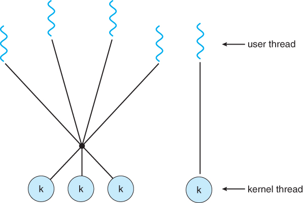

# Chapter 4. Multithread Programming - 1

# 4.1. 개요

스레드는 CPU 이용의 기본 단위이다

- 스레드는 thread id, 프로그램 카운터, 레지스터 집합, 스택으로 구성
- 같은 프로세스에 속한 다른 스레드와 코드, 데이터 섹션, 열린 파일이나 신호와 같은 운영체제 자원을 공유

프로세스가 다수의 제어 스레드를 가진다면, 프로세스는 동시에 하나 이상의 작업들을 실행할 수 있다.

## 4.1.1 동기

하나의 웹 서버에는 여러 개의 클라이언트가 접근할 수 있다.

- 하나의 단일 프로세스로 한 번에 하나만 처리할 수 있다면, 클라이언트는 매우 긴 시간을 기다려야 한다.
- 과거에는 요청을 받아들이는 프로세스가 있고, 요청이 들어올 때 그것을 실행할 별도의 프로세스를 생성했었다.
- 하지만 프로세스 생성에는 많은 시간과 자원이 필요하다.(오버헤드)

대부분의 경우 프로세스 생성보다는 여러 스레드를 만드는 것이 효율적이다.

## 4.1.2 장점

다중 스레드 프로그래밍의 장점은 네가지로 나눌 수 있다.

1. responsiveness
    1. 대화형 응용을 다중 스레드화하면 일부분이 봉쇄되거나 긴 작업을 하더라도 프로그램의 실행은 계속될 수 있다.
2. 자원 공유
    1. 스레드는 그들이 속한 프로세스의 자원들과 메모리를 공유한다.
    2. 같은 주소 공간 내에 여러 다른 작업을 하는 스레드를 가질 수 있다
3. 경제성
    1. 스레드를 생성하고 문맥을 교환하는 것이 프로세스를 생성하는 것보다 경재적이다.
4. 규모 가변성(scalability)
    1. 다중 처리기 구조에서는 각각의 스레드가 다른 처리기에서 병렬로 실행될 수 있다.
    2. 단일 스레드 프로세스는 처리기가 아무리 많아도 한 처리기에서만 실행시킨다.
    3. 병렬성을 증가시켜 규모 가변성을 높혀준다.

## 4.1.3 다중 코어 프로그래밍

최근 새로운 경향은 하나의 칩 안에 여러 계산 코어를 넣는 것이다.

- 다중 스레드 프로그래밍은 다중 코어를 더 효율적으로 사용할 수 있다.
- 하나의 코어는 한 번에 하나의 스레드만 실행할 수 있다.(단일 코어에서는 시간에 따라 교대로 실행되기만 한다.)

일반적으로 다중코어 시스템에서 프로그래밍 하기 위해서는 5가지 도전과제가 있다.

1. 작업 나누기
    1. 응용을 분석하여 각 태스크가 개별 코어 상에서 병렬적으로 실행될 수 있도록 독립된 병행가능 태스크로 나누어야 한다.
2. 균형(balance)
    1. 나누어진 태스크들이 균등한 기여도를 갖도록 나누는 것도 매우 중요하다.
    2. 기여도가 적은 작업을 위해 별도의 코어를 사용하는 것은 낭비가 될 수 있다.
3. 데이터 분리(data spliting)
    1. 태스크가 접근하고 조작하는 데이터 또한 개별 코어에서 사용할 수 있도록 나우어져야 한다.
4. 데이터 종속성(data dependency)
    1. 태스크가 접근하는 데이터는 둘 이상의 태스크 사이에 종속성이 없는지 검토되어야 한다.
    2. 종속성이 있는 경우 태스크의 실행을 잘 동기화해야 한다.
5. 시험 및 디버깅
    1. 병행 프로그램을 시험하고 디버깅하는 것은 어렵다.

# 4.2 다중 스레드 모델(Multithreading models)

스레드를 위한 지원은 두 가지 수준에서 제공된다.

1. user thread
    - 커널 위에서 지원되며 커널의 지원 없이 관리된다.
2. kernel thread
    - 운영체제에 의해 직접 지원되고 관리된다.

사용자 스레드와 커널 스레드는 다음 3가지 방법으로 관계를 가진다.

## 4.2.1 다대일 모델

스레드 관리는 사용자 공간의 라이브러리에 의해 행해진다.

- 효율적인 부분도 있지만, 한 스레드가 블로킹을 발생시키면 전체 프로세스가 봉쇄된다.
- 한 번에 하나의 스레드만 커널에 접근할 수 있기 때문에 병렬로 작동할 수 없다.

## 4.2.2 일대일 모델

각 사용자 스레드를 각각 하나의 커널 스레드로 매핑한다.

- 하나의 스레드가 블로킹을 발생시켜도 다른 스레드가 실행될 수 있기 때문에 다대일 보다 많은 병렬성을 제공한다.
- 다중처리기에서 다중 스레드가 병렬로 실행되는 것을 허용한다.

이 모델의 단점은 사용자 스레드를 생성할 때 커널 스레드를 생성해야 한다는 점이다.

- 이 오버헤드가 프로그램의 성능을 저하시킬 수 있다.
- 이 모델의 대부분의 구현은 시스템에 의해 지원되는 스레드의 수를 제한한다.
- 윈도우즈와 리눅스가 이 방식

4.2.3 다대다 모델

여러 개의 사용자 수준 스레드를 그보다 작거나 같은 커널 스레드로 multiplex한다.

- 커널 스레드의 수는 응용 프로그램이나 특정 기계에 따라 결정된다.
- 
- 다대다 모델은 앞의 두 가지 단점을 어느 정도 해결하였다.
    1. 사용자는 필요한 만큼 많은 사용자 스레드를 생성할 수 있고
    2. 커널 스레드가 다중 처리기에서 병렬로 실행될 수도 있다.
    3. 다른 스레드가 블로킹을 발생시켰을 때 커널이 다른 스레드의 실행을 스케줄할 수 있다.
- two-level model - 흔한 변형은 하나의 사용자 스레드를 하나의 커널 스레드에 종속되도록 허용하는 것이다.

# 4.3 스레드 라이브러리

스레드 라이브러리는 프로그래머에게 스레드를 생성하고 관리하기 위한 API를 제공한다.

스레드 라이브러리를 구현하는 데에는 두 가지 방법이 있다.

1. 사용자 공간에서만 라이브러리 제공
    - 사용자 공간에 모든 코드와 자료구조가 존재한다.
    - 시스템 콜이 아니라 사용자 공간의 지역 함수를 호출하여 사용한다.
2. 커널 수준 라이브러리 
    - 라이브러리를 위한 코드와 자료 구조는 커널에 존재
    - 라이브러리 호출은 결국 커널 시스템 콜을 부르는 결과를 낳는다

현재 세 종류의 라이브러리가 사용된다.

1. POSIX Pthreads
    - 사용자 혹은 커널 라이브러리로 제공
2. Win32
    - 커널 라이브러리
3. Java
    - 호스트 시스템에서 사용가능한 스레드 라이브러리를 사용하여 구현된다

## 4.3.1 Pthreads

POSIX가 스레드 생성과 동기화를 위해 제정한 표준 API

- 동작에 관한 명세일 뿐 구현한 것은 아니다.
- 운영체제 각자의 방식으로 구현한다.

## 4.3.2 Win32 Threads

Win32 Thread API도 개별 스레드가 공유하는 데이터는 전역 변수로 선언된다.

## 4.3.3 Java Thread

모든 Java 프로그램은 적어도 하나의 단일 제어 스레드를 포함하고 있다.

- main 함수로만 이루어진 단순한 자바 프로그램도 JVM 내 하나의 단일 스레드로 실행

# 4.4 스레드와 관련된 문제들

## 4.4.1 Fork() 및 Exec() 시스템 콜

다중 스레드 프로그램에서는 fork()와 exec()의 의미가 달라질 수 있다.

1. fork() 호출 시 새로운 프로세스는 모든 스레드를 복제해야 하는가 아니면 한 개의 스레드만 가지는 프로세스여야만 하는가?
    1. 몇몇 UNIX 기종은 둘 다 제공한다.
2. exec() 시스템 콜을 부르면 지정된 프로그램이 모든 스레드를 포함한 전체 프로세스를 대체시킨다.
    1. 따라서 이런 경우 fork에서 모든 스레드를 복제하는 것은 낭비가 될 수 있다.
    2. exec을 부르지 않을 경우에는 모든 스레드를 복제해야 할 수도 있다

## 4.4.2 취소

스레드 취소는 끝나기 전에 스레드를 강제 종료시키는 작업을 일컫는다.

취소되어야 할 스레드를 target thread라 하며, 취소는 다음 두 가지 방식으로 일어날 수 있다.

1. 비동기식 취소 - 한 스레드가 타겟 스레드를 즉시 강제 종료 시킨다.
    - 스레드가 공유하는 자료구조를 갱신하던 중에 취소되도 문제
    - 비동기적으로 스레드를 취소하면 일부 자원을 사용할 수 없어질 위험이 있다.
2. 지연 취소(deferred cancellation) - 타겟 스레드가 주기적으로 자신이 강제 종료해야 하는 지를 검사한다.
    - 한 스레드가 타겟 스레드가 취소되야 한다고 표시하지만 실제 취소는 타겟 스레드가 플래그를 검사한 이후에 일어난다.
    - POSIX에서는 플래그를 검사하는 지점을 취소점이라고 부른다

## 4.4.3 신호 처리(signal handling)

시그널은 UNIX에서 프로세스에게 어떤 사건이 일어났음을 알려주기 위해 사용된다.

1. 동기식
    - 신호를 발생시킨 연산을 실행한 동일한 프로세스에 전달된다.
    - 0으로 나누기, 불법적 메모리 접근 등
2. 비동기식
    - 프로세스 외부에서 신호가 발생한 경우
    - control c로 강제 종료, 타이머 만료 등

모든 신호는 다음과 같은 형태로 전달된다.

1. 신호는 특정 사건 발생시 생성
2. 신호 생성시 프로세스에 전달
3. 신호가 전달되면 반드시 처리되어야 한다.

모든 신호는 둘 중 하나의 처리기에 의해 처리된다.

1. 디폴트 신호 처리기
    - 모든 신호마다 커널에 의해 실행되는 디폴트 신호 처리기가 있다.
    - 어떤 신호는 무시되고 어떤 신호는 프로세스를 강제 종료 시킨다.
2. 사용자 정의 신호 처리

다중 스레드 프로그램에서는 어느 스레드에 신호를 전달할지에 대한 선택이 존재한다.

1. 신호가 적용될 스레드에 전달
2. 모든 스레드에 전달
3. 몇몇 스레드들에만 선택적으로 전달
4. 특정 스레드가 모든 신호를 받도록 지정

신호를 전달할 방법은 신호의 유형에 따라 다르다.

- 동기적 신호는 신호를 야기한 스레드에게 전달되어야 하고 다른 스레드에게 전달되면 안된다.
- 비동기적 신호는 명확하지 않기 때문에 모든 스레드에 전달되어야 한다.
    - 어떤 경우에는 받겠다고 지정한 스레드들에만 신호를 전달한다. (이 경우 첫 번째 스레드에만 신호를 전달한다)

윈도우는 신호를 명시적으로 지원하진 않지만 Asynchronous Procedure Calls, APC)를 이용해 이를 대리 실행할 수 있다

- APC는 사용자 스레드들이 특정 사건의 발생을 전달 받았을 때 호출될 함수를 지정할 수 있게 한다.
- 이름에서 알 수 있듯 UNIX의 비동기식 신호와 유사하다.

## 4.4.5 Thread pool

다중 스레드의 여러 문제를 해결하기 위해 스레드 풀을 사용한다.

1. 스레드 생성에는 그래도 시간이 소요됨
2. 모든 요청마다 스레드를 생성하면 시스템 자원이 고갈될 수 있다
	- 따라서 갯수를 제한해주어야 한다.

프로세스를 시작할 때 아예 일정한 수의 스레드를 미리 풀로 만들어둔다.

- 이 스레드들은 평소에는 일감을 기다리다가, 요청이 들어오면 한 스레드에게 서비스 요청을 할당한다.
- 요청을 다 서비스한 이후에는 다시 풀로 들어가 다음 작업을 기다린다.
- 풀에 남아 있는 스레드가 없을 때에는 서버는 가용 스레드가 생길 때까지 기다린다.

이런 스레드 풀은 아래와 같은 장점을 갖는다.

1. 새 스레드를 만드는 것 보다 더 빠르다.
2. 스레드 풀은 스레드 개수에 제한을 둔다.

## 4.4.5 스레드별 데이터

각 스레드가 자기만 액세스할 수 있는 데이터를 가져야 할 필요가 있는데 이를 스레드별 데이터(thread-specific) 데이터라고 부른다.

트랜잭션 처리 시스템에서 각 트랜잭션을 독립된 스레드가 처리한다고 가정하면, 해당 트랜젝션 식별자를 스레드별로 가지고 있어야 할 수 있다.

## 4.4.6 스케줄러 액티베이션

스레드 라이브러리와 커널의 통신 문제를 고려해야 한다.

- 다대다 및 두 수준 모델에서 해결해야 할 문제이다.
- 이러한 통신의 조정으로 커널 스레드의 수를 동적으로 조정할 수가 있다.

이런 많은 시스템에서는 사용자와 커널 스레드 사이에 중간 자료 구조인 경량 프로세스(LWP)를 둔다.

- 사용자 스레드 라이브러리에게 LWP는 스케줄할 가상 처리기 처럼 보인다.
- 각 LWP는 하나의 커널 스레드에 부속되어 있으며
- 물리 처리기에서 스케줄하는 대상은 바로 이 커널 스레드이다.
- I/O가 완료되기를 기다리는 동안 커널 스레드가 블록되면 LWP도 블록되고, 또 사용자 스레드도 블록된다.
- CPU 중심 응용 프로그램은 LWP를 조금 필요로 하지만 I/O 중심 응용 프로그램은 LWP를 많이 필요로 한다.

사용자 스레드 라이브러리와 커널 스레드 간의 통신 방법 중의 하나는 스케줄러 액티베이션이다.

- 커널은 응용에게 LWP의 집합을 제공하고, 응용은 사용자 스레드를 가용한 LWP로 스케줄한다.
- 커널은 응용에게 특정 사건에 대해 알려줘야 하는데 이 프로시저를 업콜이라고 부른다.
- 응용 스레드가 블록하려고 하면, 커널은 스레드가 블록된다는 사실과 스레드의 식별자를 알려주는 업콜을 한다.
- 이후 커널은 새로운 LWP를 응용에게 할당한다.
- 응용은 가상 처리기 상에서 업콜 처리기를 실행한다
- 이 업콜 처리기는 봉쇄 스레드의 상태를 저장하고, 이 스레드가 실행하던 LWP를 반환한다.
- 그리고 업콜 처리기는 새로운 LWP에서 실행 가능한 다른 스레드를 스케줄한다.
- 블록 스레드가 기다리던 사건이 발생하면 커널은 이전에 블록되었던 스레드가 이제 실행 가능하다는 사실을 알려주는 업콜을 보낸다.
- 이 사건을 처리하는 업콜 처리기도 LWP를 매칭하여 블록이 풀린 스레드를 실행 가능 상태로 표시한 이후에 응용은 가상 처리기 상에서 실행 가능한 다른 스레드를 실행한다.

# 4.5 운영체제 사례

## 4.5.1 Xindows XP 스레드

스레드를 위해 아래 자료구조를 가지고 있다.

1. ETHREAD - Executive thread block
    - 스레드가 속한 프로세스를 가리키는 포인터와 
    - 그 스레드가 실행을 시작해야 할 루틴의 주소
2. KTHREAD - kernel thread block
    - 스레드의 스케줄링 및 동기화 정보
    - 커널 스택과 TEB에 대한 포인터를 갖고 있음
3. TEB - thread environment block
    - 사용자 모드에서 실행될 때 접근되는 사용자 공간 자료 구조
    - 스레드 식별자, 사용자 모드 스택, 스레드별 데이터

    
    
## 4.5.2 Linux Thread

Linux에서는 프로세스와 스레드를 구별하지 않는다. 대신 프로그램 내의 제어 흐름을 태스크라는 용어를 사용해 표현한다.

- clone()을 통해 스레드를 생성할 수 있는 기능도 제공한다.
- 단 플래그를 통해 공유하는 자원을 결정한다.
- 아무 플래그 없이 호출한 clone()은 fork와 같다

