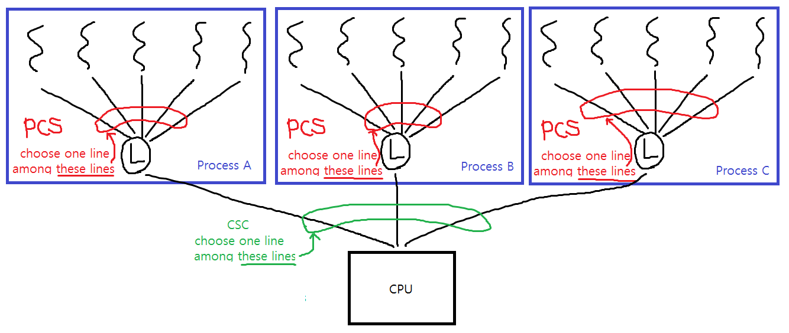

# Chapter 5. CPU 스케줄링

# 5.1 기본 개념

다중 프로그래밍의 목적은 CPU 이용률을 최대화하기 위해 항상 실행 중인 프로세스를 가지는 것이다.

- 프로세스는 전형적으로 어떤 I/O 요청이 완료되기를 기다려야만 할 때까지 실행된다.
- 이 때에는 CPU가 낭비되기 때문에 다중 프로그래밍을 사용해 이런 시간을 생산적으로 활용하려 한다.

## 5.1.1 CPU-입출력 버스트 사이클

프로세스 실행은 CPU 실행과 입출력 대기의 사이클로 구성된다. 

- 프로세스들은 두 상태 사이를 교대로 왔다 갔다 한다.
- 프로세스 실행은 CPU burst로 시작된다.
- 뒤이어 입출력 burst가 발생하고
- 이는 반복되다가 시스템이 종료된다.


CPU 버스트들의 지속 시간을 광범위하게 측정하면

- CPU 버스트 지속시간이 짧은 경우가 대부분이다.
- 입출력 중심의 프로그램은 전형적으로 짧은 CPU 버스트를 많이 가질 것이다.
- CPU 중심 프로그램은 다수의 긴 CPU 버스트를 가질 수 있다.

이런 점을 고려하여 CPU 스케줄링 알고리즘을 잘 선택해야 한다.


## 5.1.2 CPU 스케줄러

CPU가 유휴 상태가 될 때마다 운영체제는 준비완료 큐에 있는 프로세스 중에서 실행될 프로세스를 선택해야 한다.

선택 절차는 단기 스케줄러(CPU 스케줄러)에 의해 실행된다.

- 스케줄러는 실행 준비가 되어 있는 메모리 내의 프로세스들 중에서 선택하여 하나의 CPU를 할당한다.

준비완료 큐에 대해서 설명하자면 

1. 준비 완료 큐는 반드시 FIFO 방식의 큐가 아니여도 된다.
	- FIFO, Priority Queue, Tree, List 등으로 구현할 수 있다.
2. 준비 완료 큐에 있는 모든 프로세스들은 CPU에서 실행될 기회를 기다리며 대기하고 있다.
	- 큐에 있는 레코드들은 프로세스 제어 블록(PCB) 들이다

## 5.1.3 선점 스케줄링(Preemptive Scheduling)

CPU 스케줄링은 다음 네 가지 상황 하에서 발생한다.

1. 한 프로세스가 실행 상태에서 대기 상태로 전환될때
	- 입출력 요청
	- wait를 호출할 때(자식 프로세스들 중 하나가 종료되기를 기다리기 위해)
2. 프로세스가 실행 상태에서 준비완료 상태로 전환될 때
	- 인터럽트가 발생
3. 프로세스가 대기 상태에서 준비완료 상태로 전환될 때
	- 입출력 종료나 wait 상황 종료
4. 프로세스가 종료할 때

- 상황 1,4의 경우 어떤 스케줄링 방식을 사용해도 스케줄링이 실행되어야 한다.
- 상황 2,3의 경우에는 선택의 여지가 있다.

상황 1,4에서만 스케줄링을 발생시키는 방법을 비선점(non-preemptive/cooperative)이라 하고 그렇지 않으면 선점(preemptive)라 한다.

비선점 스케줄링 하에서는 일단 CPU가 한 프로세스에 할당되면, 프로세스가 종료하든지 대기 상태로 전환해 CPU를 방출할 때까지 CPU를 점유한다.

대부분의 현대 운영체제는 선점 스케줄링을 사용하고 있다.

- 선점 스케줄링은 공유 자료를 접근하는 경우를 위해 새로운 매커니즘이 필요하다.
- 어떤 프로세스의 시스템 콜 처리를 위해 커널이 중요한 변경을 하고 있을 때에 해당 프로세스가 선점되면 문제가 생길 것이다.
	- 대부분의 운영체제는 문맥 교환 실행 전에 시스템 콜/입출력 블록을 기다리므로써 문제를 해결한다.
	- 운영체제는 이를 위해 필요한 경우 진입점에서 인터럽트를 막고 출구에서 다시 가능하게 한다.
	- 이 코드 부분은 가능한 한 적어야 한다.

##	디스패처

디스패처는 CPU의 제어를 단기 스케줄러가 선택한 프로세스에 주는 모듈이며 다음 작업도 수행한다.

1. 문맥 교환
2. 사용자 모드로 전환하는 일
3. 프로그램을 다시 시작하기 위해 사용자 프로그램의 적절한 위치로 이동하는 일

디스패처는 모든 프로세스의 문맥 교환 시 호출되므로 가능한 한 빨라야 한다.

- 하나의 프로세스를 중단시키고 다른 프로세스를 실행시키는 데까지 소요되는 시간을 디스패치 지연이라 한다.(dispatch latency)

# 5.2 스케줄링 기준

CPU 스케줄링 알고리즘을 비교하기 위해 사용되는 기준은 다음과 같다.

1. CPU 이용률(utilization)
	- 가능한 한 CPU를 최대한 활용해야 한다.
	- 0~100(보통은 40~70의 값을 나타냄)
2. 처리량(throughput)
	- 하나의 방법으로는 단위 시간당 완료된 프로세스의 개수
	- 프로세스의 길이에 따라 이 수의 의미가 다를 수 있다.
3. 총처리 시간(turnaround time)
	- 프로세스를 실행하는 데 소요된 시간
	- 프로세스의 제출 시간과 완료 시간의 간격을 의미한다.
	- 메모리에 적재되기까지 기다린 시간 + 준비완료 큐에서 대기한 시간 + CPU에서 실행하는 시간 + 입출력 시간
4. 대기 시간(waiting time)
	- CPU 스케줄링 알고리즘은 프로세스가 실행하거나 입출력하는 시간의 양에 영향을 미치지 않음
	- 오직 프로세스가 준비완료 큐에서 대기하는 시간의 양에만 영향을 준다.
	- 대기 시간은 준비완료 큐에서 대기하면서 보낸 시간의 합
5. 응답 시간(response time)
	- 대화식 시스템에서는 이 기준이 중요하다.
	- 하나의 요구를 제출한 후 첫 번째 응답이 나올 때까지의 시간
	- 일반적으로 출력 장치의 속도에 의해 제한된다.

일반적으로

1. CPU 이용률과 처리량을 최대화하고 다른 것들을 낮추는 것이 바람직하다.
2. 모든 사용자들이 좋은 서비스를 얻도록 최대 응답 시간을 최소화해야 할 수 있다.
3. 대화식 시스템에서 평균 응답 시간이 아니라 응답 시간의 변동폭을 줄이는 것이 중요할 수 있다.

이후에는 평균 대기시간 위주로 비교한다.

# 5.3 스케줄링 알고리즘

## 5.3.1 선입 선처리 스케줄링(First-Come, First-Served Scheduling, FCFS)

CPU를 먼저 요청하는 프로세스가 CPU를 먼저 할당받는다.

- FIFO 큐로 쉽게 관리 가능하다.
	1. 프로세스가 준비완료 큐에 진입하면, 이 프로세스의 PCB를 큐의 맨 끝에 연결한다.
	2. CPU가 유휴 상태가 되면 준비완료 큐의 앞부분에 있는 프로세스에 할당된다.
	3. 실행 중인 프로세스는 준비완료 큐에서 제거된다.
- FCFS는 작성/이해가 쉽다.

FCFS에서 평균 대기 시간은 종종 대단히 길어질 수 있다.

- FCFS에서 평균 대기시간은 최소가 아니고, 버스트 시간이 크게 변할 경우 이도 크게 변할 수 있다.

호위효과(convoy effect)라 생길 수 있다.

- 모든 다른 프로세스들이 하나의 긴 프로세스가 CPU를 양도하기를 기다리는 상황
- 짧은 프로세스들이 먼저 처리되도록 허용될 때보다 CPU와 장치 이용률이 저하됨

FCFS는 비선점형이다.

- 일단 CPU가 한 프로세스에 할당되면, 종료되거나 입출력 처리를 요구하여 CPU를 방출할 때까지 점유한다.
- 특히 시분할 시스템에서는 각 사용자가 규칙적인 간격으로 CPU를 얻어야 하는데 그럴 수 없어 문제가 된다.
	- 한 프로세스가 지나치게 오랜 시간 CPU를 점유하도록 허용하기 때문이다.

### 예시
 
- P1, 24 
- P2, 3
- P3, 3

평균 대기시간

- (0 + 24 + 27)/3 = 17


- P2, 3
- P3, 3
- P1, 24 

평균 대기시간

- (6 + 0 + 3)/3 = 3


## 5.3.2 최단 작업 우선 스케줄링(Shrtest-Job-First Scheduling, SJF)

이 알고리즘은 각 프로세스에 다음 CPU 버스트 길이를 연관시킨다.

- CPU가 이용 가능해지면 다음 CPU 버스트가 가장 작은 프로세스에게 할당한다.
- 버스트가 같다면 FCFS를 적용한다.
- 프로세스의 전체 길이가 아니라 다음 CPU 버스트의 길이에 의해 스케줄링 되기 때문에 shortest-next-CPU-burst 알고리즘이라는 용어가 더 적합하다.

SJF 스케줄링은 주어진 프로세스 집합에 대해 최소의 평균 대기시간을 가진다.

- 짧은 프로세스를 앞으로 이동시켜 줄어드는 대기시간이 긴 프로세스의 늘어난 대기 시간보다 더 크다.

### 예시

- P1, 6
- P2, 8
- P3, 7
- P4, 3

평균 대기시간

- (3 + 16 + 9 + 0) / 4 = 7


하지만 다음 CPU 버스터의 길이를 파악하는 것이 어렵다.

- 일괄 처리 시스템에서 장기 스케줄링의 경우 사용자가 작업을 제출할 때 시간 제한 길이를 이용해 길이를 예상할 수 있다.
- 실제 사용량보다 낮을 경우 오류를 발생시켜 정확하게 예측하도록 강제할 수 있다.

단기 CPU 스케줄링에서는 구현이 불가능하다.

- CPU 버스터 길이를 알 수 있는 방법이 없기 때문

한 가지 접근 방식은 SJF에 가깝게 스케줄링하는 것이다.

- 다음 CPU 길이를 알 수는 없으나, 예측은 할 수 있다.
- 이전의 버스트와 길이가 비슷하다고 기대할 수 있다.

다음 CPU 버스트는 일반적으로 이전의 CPU 버스트들의 측정된 길이를 지수 평균한 것으로 예측한다.

매개변수 alpha는 최근 값과 이전 예측 값의 가중치를 조정한다. 

- 0이면 최근 값보다는 예측값을 중시한다.
- 1이면 최근의 CPU 버스트만 중시한다.
- 보통은 1/2를 사용한다.


```
estimate[ i + 1 ] = 
   alpha * burst[ i ] + ( 1.0 - alpha ) * estimate[ i ]
```


SJF는 선점형이거나 비선점형일 수 있다.

- 새로운 프로세스가 실행 중인 프로세스의 남은 시간보다 더 짧은 CPU 버스트를 가질 수도 있다.
	- 선점형일 경우 실행중인 프로세스를 선점할 것이다.
		- 선점형 SJF 알고리즘은 최소 잔여시간 우선 스케줄링이라고도 부른다.
	- 비선점형일 경우 실행중인 프로세스의 CPU 버스트를 끝내도록 허용할 것이다.

### 선점형 예시

Process, Arrival Time, Burst Time

- P1, 0, 8
- P2, 1, 4
- P3, 2, 9
- p4, 3, 5

평균 대기시간

- ((10 - 1) + (1 - 1) + (17 - 2) + (5 - 3)) / 4 = 26 / 4 = 6.5


## 5.3.3 우선순위 스케줄링(Priority Scheduling)

우선순위 알고리즘은

- 우선순위가 각 프로세스들에 연관되어 있으며, CPU는 가장 높은 우선순위를 가진 프로세스에 할당된다.
- 우선순위가 같을 경우에는 FCFS 순서로 스케줄 된다.

SJF 알고리즘은 일반적인 우선순위 알고리즘의 특별한 경우이다.

- 예상되는 다음 CPU 버스트의 반대를 우선순위로 갖는다.
- CPU 버스트가 클수록 우선순위가 낮다.

우선순위는 일반적으로 0~7와 같은 일정 범위의 수가 사용된다.

### 예시

여기서는 낮은 수의 우선순위가 높은 우선순위를 나타낸다고 한다.

Process, Burst Time, Priority

- P1, 10, 3
- P2, 1,  1
- P3, 2,  4
- P4, 1,  5
- P5, 5,  2

평균 대기 시간

- (0 + 1 + 6 + 16 + 18) / 5 = 41 / 5 = 8.2


우선순위는 내부적 또는 외부적으로 정의될 수 있다.

1. 내부적
	- 시간 제한, 메모리 요구, 열린 파일의 수, 
	- 평균 입출력 버스트의 평균 CPU 버스트에 대한 비율 등
2. 외부적
	- 프로세스의 중요성
	- 컴퓨터 사용을 위해 지불되는 비용의 타입과 양
	- 부서, 정치적인 요인

우선순위 스케줄링도 선점형이나 비 선점형이 될 수 있다.

우선순위 스케줄링 알고리즘의 주요 문제는 무기한 봉쇄(indefinite blocking) 또는 기아 상태이다.

- 실행 준비는 되어 있으나 CPU를 사용하지 못하는 프로세스는 블록된 것으로 간주될 수 있다.
- 낮은 우선순위 프로세스들이 CPU를 무기한 대기하는 경우 발생
- 부하가 과중한 컴퓨터의 경우 낮은 우선순위 프로세스들이 CPU를 얻지 못하게 될 수 있다.

이 경우 프로세스가 늦게나마 실행되거나 컴퓨터 시스템이 크래시할 때 잃어버리게 된다.

낮은 우선순위의 프로세스들을 무기한 블록하는 문제에 대한 해결 방안은 노화이다.(aging)

- 오랜 기간 시스템에서 대기하는 프로세스들의 우선순위를 점진적으로 증가

## 5.3.4 라운드 로빈 스케줄링

라운드 로빈(RR) 스케줄링은 시분할 시스템을 위해 설계되었다.

- FCFS와 비슷하지만 시스템이 프로세스들 사이를 옮겨 다닐 수 있도록 선점이 추가된다.
- 시간 할당량(time quantum) 또는 시간 조각(time slice)라는 작은 단위의 시간을 정의한다(일반적으로 10~100밀리초)
- 준비완료 큐는 원형큐로 동작한다.
- CPU 스케줄러는 준비완료 큐를 돌면서 한 번에 한 프로세스에게 한 번의 시간 할당량 동안 CPU를 할당한다.

RR을 구현하기 위해 준비완료 큐를 프로세스들의 FIFO로 유지한다.

1. 새로운 프로세스들은 준비완료 큐의 꼬리에 추가된다
2. 스케줄러는 준비완료 큐에서 첫 번째 프로세스를 선택해 한 번의 시간 할당량 이후에 인터럽트를 걸도록 타이머를 설정한 후, 프로세스를 디스패치 한다.
3. 이 경우 두 가지 중 하나가 발생한다.
	1. 프로세스의 CPU 버스트가 한 번의 시간 할당량보다 적을 경우
		- 스케줄러는 준비완료 큐에 있는 다음 프로세스로 진행한다
	2. 현재 실행 중인 프로세스의 CPU 버스트가 한 번의 시간 할당량보다 긴 경우
		- 타이머가 만료되면 운영체제에게 인터럽트를 발생시킨다.
		- 문맥 교환이 일어나고 실행하던 프로세스는 준비완료 큐의 꼬리에 넣어진다.
4. 스케줄러는 준비완료 큐의 다음 프로세스를 선택한다.

종종 RR 정책하에서 평균 대기시간은 길다.

RR 알고리즘의 성능은 시간 할당량의 크기에 매우 많은 영향을 받는다.

- 매우 크면 FCFS와 같다.
- 매우 작으면, processor sharing이라 불리며, 문맥 교환 비용이 크게 발생한다.
- CPU 버스트의 80%가 시간 할당량보다 짧을 때 성능이 가장 좋다.


총 처리 시간(turnaround time)도 시간 할당량의 크기에 좌우된다.


### 예시

- P1, 24
- P2, 3
- P3, 3

평균 대기 시간

- ((10 - 4) + 4 + 7) / 3 = 5.66


## 5.3.5 다단계 큐 스케줄링(Multilevel Queue Scheduling)

다단계 큐 스케줄링 알고리즘은 준비완료 큐를 다수의 별도의 큐로 분류한다.

- 일반적으로 프로세스들은 메모리 크기, 프로세스의 우선순위/유형 과 같은 특성에 따라 한 개의 큐에 영구적으로 할당된다.
- 각 큐는 자신의 스케줄링 알고리즘을 갖고 있다.
- e.g, 포그라운드(RR)/백그라운드(FCFS)
- 큐와 큐 사이에 스케줄링도 반드시 있어야 하며 일반적으로는 선점형 고정 우선순위로 구현된다.
	- 예를들어 포그라운드 큐는 백그라운드 큐보다 높은 우선순위를 가질 수 있다.


## 5.3.6 다단계 피드백 큐 스케줄링

다단계 큐 스케줄링 알고리즘에서는 프로세스들이 큐 간에 이동을 하지 않는다. 

- 포그라운드와 백그라운드의 특성을 잘 바꾸지 않기 때문이다.
- 이런 방식은 스케줄링 오버헤드는 적지만 융통성 또한 적다.

다단계 피드백 큐 스케줄링에서는 프로세스가 큐 사이를 이동하는 것을 허용한다.

- 프로세스들을 CPU 버스트 성격에 따라서 구분하는 것이다.
- CPU 시간을 너무 많이 사용하면, 낮은 우선순위의 큐로 이동
- I/O 중심, 대화형 프로세스들을 높은 우선순위의 큐로 이동시킨다.
- 마찬가지로 낮은 우선순위의 큐에서 오래 대기하는 프로세스를 높은 우선순위의 큐에 넣는다.
	- aging으로 기아 상태를 예방한다.

번호가 0에서 2까지인 세 개의 큐를 가진 다단계 피드백 큐 스케줄러를 생각해보자.

1. 스케줄러는 처음에 큐 0의 모든 프로세스들을 실행시킨다.
2. 큐 0이 비어있을 때만 큐 1에 있는 프로세스를 실행시킨다.
3. 마찬가지로 큐 0과 1이 비어 있을 때만 큐 2에 있는 프로세스들이 실행된다.
4. 큐 1에 도착한 프로세스는 큐 2에 있는 프로세스를 선점한다.
	- 마찬가지로 큐 0에 도착한 프로세스는 큐 1에 있는 프로세스를 선점한다.

이렇게 동작할 것이다.

1. 준비완료 큐로 들어오는 프로세스는 큐 0에 넣어진다.
2. 큐 0에 있는 프로세스에게는 8밀리초의 시간 할당량이 주어진다.
	- 만약 이 시간안에 끝나지 않으면 큐 1의 꼬리로 이동된다.
3. 만약 큐 0이 비어있다면 큐 1의 머리에 있는 프로세스에 16밀리초의 시간 할당량이 주어진다.
	- 만약 이 시간안에 끝나지 않으면 큐 2의 꼬리로 이동된다.
4. 큐 0과 큐 1이 비어있을 때만 큐 2에 있는 프로세스들이 FCFS로 실행된다.


위의 방식은 CPU 버스트가 8밀리초 이하인 모든 프로세스에 최고의 우선순위를 부여한다.

- CPU 버스트가 긴 프로세스는 자연스레 큐 2로 이동되며 큐 0과 1이 비어있을 때 처리된다.

다단계 피드백 큐 스케줄러는 다음의 매개변수에 의해 정의된다.

1. 큐의 개수
2. 각 큐의 스케줄링 알고리즘
3. 프로세스를 높은 우선순위큐로 올려주는 시기 결정 방법
4. 프로세스를 낮은 우선순위큐로 강등시키는 시기 결정 방법
4. 프로세스가 서비스를 필요로 할 때 프로세스가 들어갈 큐를 결정하는 방법

# 5.4 스레드 스케줄링

사용자 수준과 커널 수준 스레드를 지원하는 운영체제에서는 프로세스가 아닌 커널 수준 스레드를 대상으로 스케줄한다.

- CPU 상에서 실행되기 위해서 LWP를 통한 간접적인 방식을 사용하더라도 사용자 수준 스레드는 궁극적으로는 커널 수준 스레드에 사상되어야 한다.

## 5.4.1 경쟁 범위(Contention Scope)

프로세스 경쟁 범위(Process Contention Scope, PCS)

- 다대일, 다대다 모델을 구현하는 시스템에서는 스레드 라이브러리는 사용자 수준 스레드를 가용한 LWP 상에서 스케줄한다.
- 이 구조는 동일한 프로세스에 속한 스레드들 사이에서 CPU를 경쟁한다.
- LWP 상에서 스케줄하는 것은 CPU상에서 실행 중이라는 것을 의미하지 않는다.
- 전형적으로 PCS는 우선순위에 따라 행해진다.
- 더 높은 우선순위의 스레드가 낮은 우선순위를 선점한다.

시스템 경쟁 범위(System Contention Scope, SCS)

- CPU상에 어느 커널 스레드를 스케줄링할 것인지 결정
- Windows XP, Solaris, Linux 같은 일대일 모델을 사용하는 시스템은 SCS 만을 사용해 스케줄한다.



## 5.4.2 Pthread 스케줄링

PThread에는 PCS와 SCS를 지정할 수 있는 API가 있다.

1. PTHREAD_SCOPE_PROCESS - PCS 스케줄링 사용 스레드 스케줄
	- 다대다 모델을 구현하는 시스템에서는 해당 옵션을 줄 때 사용자 수준 스레드를 가용한 LWP로 스케줄
2. PTHREAD_SCOPE_SYSTEM - SCS 스케줄링 사용 스레드 스케줄
	- 다대다 모델을 구현하는 시스템에서는 해당 옵션을 줄 때 사용자 스레드마다 LWP를 생성해 바인드하여 일대일 정책을 사용하는 것 같은 효과를 만든다.

Pthread는 경쟁 범위 정책을 얻어내고 지정하 위한 두 함수를 제공한다.

1. pthread_attr_setscope(attr, scope)
2. pthread_attr_getscope(attr, scope)


# 5.5 다중 처리기 스케줄링(Multiple-Processor Scheduling)

여러 개의 CPU가 사용 가능하다면 부하 공유는 가능해지지만 스케줄링 문제는 복잡해진다.

- 최상의 해결책은 없다.

## 5.5.1 다중 처리기 스케줄링에 대한 접근 방법

1. asymmetric multiprocessing, 
	- 하나의 처리가 마스터 서버가 되어, 모든 스케줄링 결정과 입출력 처리 그리고 다른 시스템의 활동을 처리하게 하는 것
	- 다른 처리기들은 사용자 코드만을 실행한다.
	- 한 처리기만 시스템 자료 구조에 접근하여 자료 공유의 필요성을 감소시키기에 간단하다.
2. symmetric multiprocessing, SMP
	- 각 처리기가 독자적으로 스케줄링한다.
	- 모든 프로세스는 공동의 준비완료 큐에 있거나 각 처리기마다 가지고 있는 각자의 준비완료 큐에 있게 된다.
	- 스케줄링은 각 처리기의 스케줄러가 준비완료 큐를 검사해서 실행할 프로세스를 선택하여 진행된다.
	- 공동 자료 구조를 여러 처리기가 접근하고 갱신하려고 할 때 신중히 프로그램 되어야 한다.
		- 두 처리기가 같은 프로세스를 선택하지 않고 
		- 프로세스가 큐에서 사라지지 않는다는 점을 보장해야 한다.
	- 거의 모든 현대 운영체제들은 SMP를 지원한다.

## 5.5.2 처리기 친화성(Processor Affinity)

SMP 시스템은 한 처리기에서 다른 처리기로의 이주를 피하고 같은 처리기에서 다시 프로세스를 실행하려고 하는 정책을 가진다. 이를 **처리기 친화성**이라 부른다.

- 최근에 접근된 데이터가 처리기의 캐시를 채우는데, 다른 프로세스로 옮겨지면 무효화된다.
- 여기서 비용이 많이 들게 된다.

처리기 친화성의 종류

1. soft affinity - 동일한 처리기에서 프로세스를 실행시키려고 노력하지만 보장하지는 않음
2. hard affinity - 동일한 처리기에서 프로세스를 실행시키는 것을 보장

시스템은 메인 메모리 구조도 처리기 친화성 이슈에 영향을 준다.

NUMA(Non-Uniform Memory Access) 특성을 가지는 경우는 아래와 같다


## 5.5.3 부하 균등화

SMP 시스템의 모든 처리기에는 부하가 고르게 배본되어야 한다.

- 처리기가 각자의 준비완료 큐를 가지고 있는 시스템에서만 필요한 기능
- 대부분의 현대 운영체제는 처리기에게 각각 큐를 할당한다.

부하 균등화를 위해 사용되는 두 가지 접근법이 있다.

1. push 이주
	- 특정 태스크가 주기적으로 각 처리기의 부하를 검사하고 불균등 상태로 밝혀지면 과부하인 처리기에서 쉬고 있거나 덜 바쁜 처리기로 프로세스를 이동시킨다.
2. pull 이주
	- 쉬고 있는 처리기가 바쁜 처리기를 기다리고 있는 프로세스를 자기 쪽으로 가져온다.

둘 다 쓰이는 경우도 있으며 하나만 쓰이는 경우도 있다.

이 부하 균등화는 처리기 친화성의 이익에 상충한다.

- 따라서 임계값을 잘 설정해야 한다.

## 5.5.4 다중 코어 프로세서

하드웨어의 최근 경향은 하나의 물리적인 칩 안에 여러 개의 처리기 코어를 장착하는 것이다. 이를 다중 코어 프로세서라고 한다.

- 운영체제 입장에서는 별개의 물리 처리기처럼 보인다.
- 각자 자신의 물리 칩을 갖는 시스템에 비해 속도가 빠르고 전력을 적게 소모

프로세스가 메모리에 접근할 때에 데이터가 가용해지기를 기다리면서 시간이 많이 소모되는데 이 현상을 메모리 멈춤(memory stall)이라 부른다.

- 캐시 미스(데이터가 캐시에 없음) 등으로 일어난다.

이 상황을 해결하기 위해 둘 또는 그 이상의 하드웨어 스레드가 각 코어에 할당될 수 있는 다중 스레드 프로세스 코어를 구현한다.

- 한 스레드가 메모리를 기다리면서 멈추면, 코어는 다른 스레드로 전환할 수 있다.
- 운영체제의 관점에서 각 하드웨어 스레드는 소프트웨어 스레드를 실행할 수 있는 논리 프로세서로 보인다.
- 이중 스레드, 이중 코어 시스템에서는 4개의 논리 프로세서가 운영체제에 제공된다.


처리기를 다중 스레드화하는데에는 2가지 방법이 있다.

1. 크게 나눔(coarse-grained) 다중 스레딩
	- 스레드가 메모리 멈춤과 같은 긴 지연시간을 가진 사건이 발생할 때까지 한 처리기에서 실행된다.
	- 이런 사건에 의한 지연 때문에 처리기는 다른 스레드를 실행하게 된다.
	- 이 때 기존 명령어 파이프라인이 정리되고 새로운 명령어 파이프라인을 채워야 하기 때문에 스레드 간 교환 비용이 많이 필요하다.
2. 잘게 나눔(fine-grained) 다중 스레딩
	- 명령어 주기의 경계에서와 같이 좀 더 세밀한 정밀도를 가진 시점에서 스레드 교환이 일어남
	- 이 시스템을 설계할 때에는 스레드 교환 회로가 필요하고, 그 결과 비용이 줄어든다.

다중 스레드 다중 코어 프로세서는 두 단계의 스케줄링을 필요로 한다.

1. 어느 소프트웨어 스레드가 각 하드웨어 스레드(논리 프로세서)에서 실행되어야 하는지
2. 각 코어가 어떤 하드웨어 스레드를 실행시킬지

## 5.5.5 가상화와 스케줄링

- 가상화 소프트웨어는 시스템에서 실행 중인 가상기계마다 하나 이상의 가상 CPU를 제공하고 물리 CPU들을 가상기계가 사용할 수 있도록 스케줄링한다.
- 가상 기계 내의 운영체제가 얼만큼의 CPU 시간을 할당받느냐는 가상화 시스템에 달려있다.
- 가상화는 가상기계 내의 운영체제의 스케줄링 알고리즘을 무력화 시킬 수 있다.

# 5.6 운영체제 사례들

## 5.6.1 Solaris Scheduling

우선순위 기반 스레드 스케줄링을 사용하며 다음 6개의 클래스를 가진다.

1. 시분할
2. 대화형
3. 실시간
4. 시스템 - 시스템 스레드의 우선순위는 바뀌지 않는다. 커널 용으로 예약되어 있음
5. 공평 공유
6. 고정 우선순위

같은 우선순위의 스레드가 여러개 있다면 스케줄러는 RR를 사용한다


## 5.6.2 Windows XP Scheduling

우선순위 기반 선점 스케줄링 알고리즘을 사용

- 가장 높은 우선순위의 스레드가 항상 실행됨
	- 높은 우선순위 스레드에 의해 선점되거나, 연산이 끝나거나, 시간 할당량이 만료되거나, 입출력을 위한 블록을 발생시킬 때까지 실행
- 스케줄링을 담당하는 부분을 디스패처라고 부름

디스패처는 스레드의 실행 순서를 정하기 위해 32단계의 우선순위를 두고 있다.

- 0단계 - 메모리 관리를 위해 사용됨
- 가변 클래스(1-15)
- 실시간 클래스(16-31)

이를 위해 우선순위 클래스와 각 클래스에 상대적인 우선순위를 제공한다.

- 별도의 설정이 없다면 프로세스는 NORMAL 클래스에 속한다
- 스레드의 초기 우선순위는 보통 스레드가 속한 프로세스의 기본 우선순위가 배정된다.


1. 스레드의 시간 할당량이 만료되면, 그 스레드는 인터럽트 된다.
	- 가변 우선순위 클래스에 속한다면, 우선순위가 낮아진다.
	- 하지만 기본 우선순위보다 낮아지지는 않는다.
2. 가변 우선순위 스레드가 대기 연산에서 풀려나면 디스패처는 우선순위를 높여준다
	- 올라가는 우선순위는 대기의 목적에 따라 달라진다.
	- 키보드 입출력을 기다렸다면 많이 높여주고 디스크를 기다렸다면 조금 높여준다.

XP는 스크린 상에서 활성화 중인 전위 프로세스에게 시간 할당량을 보통 3배 정도 더 제공한다.

- 실행 중인 시스템에 더 좋은 성능 보장

## 5.6.3 Linux Scheduling

- 버전 2.5 전까지 전통적인 UNIX 스케줄링 알고리즘을 사용하였다
- 하지만 SMP 시스템에 대한 지원이 부족하고 다수의 태스크에 대한 확장이 용이하지 않아 교체하였다.

Linux 스케줄러는 두 개별적인 우선순위 범위를 갖는 선점형 우선순위 기반 알고리즘이다.

- 실시간 범위로는 0-99까지의 우선순위를 가진다.
- nice 범위로는 100-140까지의 우선순위를 가진다.
- 두 범위는 전역 우선순위 구조로 변환되고 더 적은 값이 높은 우선순위를 나타낸다.

리눅스는 다른 시스템과 다르게 높은 우선순위의 태스크에 더 긴 시간을 할당한다.


실행 가능한 태스크는 시간 할당량 중 남은 시간에 따라 다르게 동작한다.

- 자신의 시간 할당량을 소진하면, 만료된 것으로 간주하고 다른 태스크들이 시간 할당량을 소진할 때까지 실행 가능하지 않게 한다.

커널은 각 처리기별로 모든 실행 가능한 태스크들의 리스트를 runqueue 자료 구조에 관리하고 독립적으로 스케줄한다.

- runqueue는 active와 expired라는 두 개의 우선순위 배열을 가지고 있다.
	- active 배열은 시간 할당량이 남아 있는 모든 태스크를 포함
	- expired 배열은 만료된 태스크를 포함
	- 각 배열은 우선순위에 따라 인덱스된 태스크의 리스트를 가진다.
- 스케줄러는 active 배열에서 가장 우선순위가 높은 태스크를 선택하여 CPU에서 실행시킨다.
- 모든 태스크들이 자신의 시간할당량을 소진하면(active가 비면) expired 배열은 active 배열이 되고 active 배열은 expired 된다.


실시간 태스크는 정적 우선순위를 배정받으며 다른 태스크들은 nice값을 기반으로 하는 동적 우선순위를 갖는다.

- 태스크의 대화성향(interactivity)이 nice 값에다 5를 더할지 뺄지 결정한다.
- 대화 성향은 입출력을 기다리면서 수면한 시간이 길수록 높아진다. 따라서 nice에 -5를 적용한다.
- 이를 통해 대화형 태스크의 우선순위를 높히게 된다.
- 반대의 경우 +5를 적용한다.

태스크의 동적 우선순위는 태스크가 시간 할당량을 소진하여 expired 배열로 이동할 때 다시 계산된다.

- 그 결과 새로운 active 배열의 태스크들은 새로운 우선순위와 시간 할당을 받은 상태가 된다.


# 5.7 알고리즘의 평가

알고리즘 평가를 위해 할 첫번재 일은 기준을 정의하는 것이다.

- CPU 이용률, 응답 시간, 처리량 등

우리의 기준은 다음과 같을 수 있다.

1. 최대 응답 시간이 1초라는 제약 조건 하에서 CPU 이용률 극대화
2. 총 처리 시간이 전체 실행시간에 평균적으로 선형 비례가 되도록 처리량을 극대화

## 5.7.1 결정론적 모델링(deterministic modeling)

분석적 평가는 주어진 알고리즘과 시스템 부하를 사용하여 공식이나 값을 구한다.

분석적 평가의 한 방법으로 결정론적 모델링이 사용된다.

- 사전에 정의된 특정한 작업 부하를 받아들여 알고리즘의 성능을 정의

결정론적 모델링은 단순하고 빠르며 정확하게 비교할 수 있다.

하지만 입력으로 정확한 숫자를 요구하고 해답도 입력 값에 따라 좌우된다.

- 이 모델링은 스케줄링 알고리즘을 설명하고 본보기를 제공하는데 사용된다.
- 동일한 프로그램을 반복해 여러 번 시행하고, 프로그램의 처리 요구사항을 정확하게 측정할 수 있다면 이 모델링을 사용할 수 있다.
- 게다가 예들의 집합에 대해 별도로 분석하고 증명할 수 있는 추세를 보여줄 수 있다.
- 예를 들어 CPU Burst를 알고 있을때 SJF가 항상 대기 시간을 최소화한다는 것을 보일 수 있다.

### 예시

Process, Burst Time

- P1, 10
- P2, 29
- P3, 3
- P4, 7
- P5, 12

평균 대기 시간

- FCFS, 28ms 
- SJF, 13ms
- RR, 23ms 


## 5.7.2 큐잉 모델

많은 시스템에서 실행되는 프로세스들은 항상 변화하기 때문에 결정론적 모델링르 사용할 수 있는 프로세스의 정적인 집합이 없다.

하지만 CPU 버스트의 확률을 기술하는 수학적인 공식을 얻을 수는 있다.

- 마찬가지로 시스템에 도착하는 시간의 분포도 계산할 수 있다.

우리는 도착률과 서비스율을 알 때 CPU 이용률, 평균 큐 길이, 평균 대기 시간 등을 계산할 수 있다. 이러한 연구를 큐잉 네트워크 분석이라고 한다.

분포를 분석하는 것 자체가 어렵기 때문에 제한적으로 성능을 비교할 수밖에 없다.

- 실제 시스템의 근사치이며, 연산된 결과의 정확성이 높다고 보기는 어렵다.

## 5.7.3 모의 실험

모의 실험기는 시간을 나타내는 변수를 가지며, 이 값을 증가시켜가며 시스템의 상태를 수정해 장치들, 프로세스 및 스케줄러 등의 활동을 반영한다.

이러한 실험으로 알고리즘의 성능을 나타내는 통계들을 수집하고 인쇄한다.

모의 실험을 구동하기 위한 자료들을 생성하는 방법은 여러가지가 있다.

1. 난수 발생기
	- 확률 분포에 따라 프로세스, CPU 버스트 시간, 도착, 출발 등 생성
	- 분포는 uniform, exponential, poisson 또는 경험적으로 정의(실제 시스템의 사건을 토대로)
2. 추적 테이프 사용
	- 모의 실험을 위해 실제 시스템에서 발생하는 사건들의 순서를 기록하여 추적 테이프 만듬
	- 입력에 대한 정확한 결과 생성 가능
3. 컴퓨터를 실제로 오랫동안 사용해야 해서 비용이 많이 든다.


## 5.7.4 구현

마지막으로 구현이 있다.

- 비용이 높다.
- 따라서 특정 운영체제는 알고리즘 조정을 위한 스케줄링 변수를 미세 조정할 수 있도록 허용한다.(구현이 필요 없도록)

스케줄링 알고리즘을 평가하는 가장 믿을만한 방법은 구현하고 실세계 현상에서의 성능을 모니터링하는 것이다.