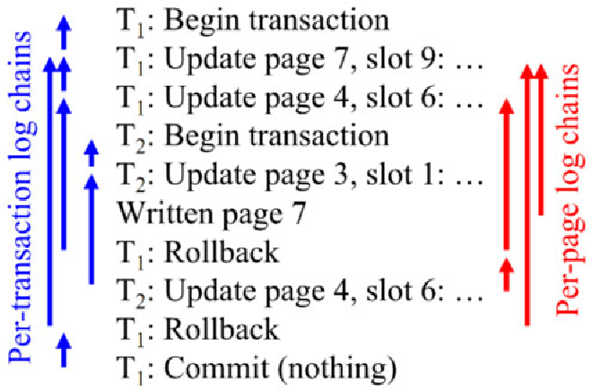

# 6.1 배경

동시에 여러개의 프로세스가 동일한 자료를 접근하여 조작하고 그 실행 결과가 접근이 발생한 특정 순서에 의존하는 상황을 경쟁 상황(race condition)이라고 한다.

경쟁 상황으로부터 보호하기 위해 한 순간에 하나의 프로세스만 자료를 조작하도록 보장해야 한다.

다중 스레드 응용에서는 자원을 공유할 가능성이 매우 높은 여러 스레드가 병렬로 실행될 수 있기에 매우 중요하다.

# 6.2 임계 영역 문제(The Critical-Section Problem)

임계 영역은 다른 프로세스와 공유하는 변수를 변경하거나, 테이블을 갱신하거나, 파일을 쓰거나 하는 등의 작업을 실행하는 영역이다.

- 한 프로세스가 자신의 임계 영역에서 실행하는 동안에는 다른 프로세스는 자신의 임계 영역에 들어갈 수 없어야 한다.
- 동시에 두 프로세스가 그들의 임계 영역 안에서 실행될 수 없다.

임계 영역 문제는 프로세스들이 협력할 때 사용할 수 있는 프로토콜을 설계하는 것이다.

1. entry section
	- 임계 영역으로 진입하기 위해 진입 허가를 요청하는 부분
2. critical section
3. exit section
4. remainder section


임계 문제의 해결안은 세가지 요구조건을 충족해야 한다.

1. 상호배제(mutual exclusion)
	- 한 프로세스가 자신의 임계 영역에서 실행된다면, 다른 프로세스는 그들 자신의 임계 영역에서 실행될 수 없다.
2. 진행(Progress)
	- 자기의 임계 영역에서 실행 중인 프로세스가 없고 자신의 임계 영역으로 진입하려고 하는 프로세스들이 있다면, 나머지 영역에서 실행 중이지 않은 프로세스들만 임계 영역으로 진입할 프로세스를 결정하는데 참여할 수 있으며, 이 선택은 무기한 연기될 수 없다.
3. 한정된 대기(bounded waiting)
	- 프로세스가 자기의 임계 영역에 진입하려는 요청을 한 후부터 그 요청이 허용될 때까지 다른 프로세스들이 자신의 임계 영역으로 진입하도록 허용되는 횟수는 한계 또는 제한이 있어야 한다.

커널의 경우 경쟁 조건이 발생하기 쉽다.

- 파일 조작이나 메모리 관리 등등
- 비선점형 커널에서는 커널에 실행 중인 프로세스가 하나 밖에 없기에 안전하다.
- 선점형 커널에서는 여러 프로세스가 실행될 수 있기 때문에 신중히 설해야 한다.

# 6.3 피터슨의 해결안

피터슨의 해결안은 임계 영역과 나머지 영역을 번갈아 가며 실행하는 두 개의 프로세스로 한정된다.

이 방법에서는 두 프로세스가 두 개의 데이터 항목을 공유하도록 한다.

- int turn 
	- 임계 영역으로 진입할 순번
	- turn=i 이면 프로세스 Pi가 임계영역에서 실행될 수 있다.
- boolean flag[2]
	- flag 배열은 프로세스가 임계 영역으로 진입할 준비가 되었다는 것을 의미

알고리즘을 설명하자면, 임계 영역으로 진입하기 위해서는

1. Pi는 먼저 flag[i]를 참으로 만들고 turn을 j로 변경한다..
	- 이를 통해 j가 먼저 임계 영역으로 진입하기를 원한다면 진입 가능하다는 것을 보장한다.
	- 만일 두 프로세스가 동시에 진입하기를 원한다면 turn은 거의 동시에 i, j로 지정될 것이다.
	- 그러나 둘 중 한 배정만이 지속된다.
	- turn의 값이 둘 중 누가 먼저 임계 영역으로 진입할 것인가를 결정한다.


이 해결책은 다음과 같은 이유로 올바르게 동작한다.

1. 상호배제
	- 임계 영역에 들어가기 위해서는 상대방의 flag가 false이고 turn이 자신이여야 한다.
	- 두 프로세스 모두 자기 임계 영역을 실행 중이라면 flag가 true 여야 한다.
	- 이 경우 둘다 while문을 동시에 지나가는 상황은 없을 것이다
		- turn은 0 혹은 1이기 때문
	- 한 프로세스 j가 진입한 이후에 나머지 Pi는 while을 다시 진입하게 되고 Pj가 종료될 때까지는 계속 대기하게 된다. 
	- Pj가 임계 영역에서 벗어나야만 while문을 빠져나올 수 있게 된다.
2. 진행
3. 한정된 대기
	- Pi는 Pj가 지난번에 진입했다면 자기도 한 번은(한정된 대기) 들어갈 수 있도록(진행) 보장된다.

# 6.4 동기화 하드웨어(Synchronization Hardware)

일반적으로 임계 영역에 대한 임의의 해결책은 락이라는 도구를 사용하는 것이다.

- 경쟁 조건은 임계 영역이 락에 의해 보호되게 함으로서 예방할 수 있다.
- 프로세스는 임계 영역에 진입할 때 락을 획득하고 벗어날 때 방출한다.

임계 영역 문제는 단일처리기에서는 공유 변수가 변경되는 동안 인터럽트 발생을 막음으로써 해결할 수 있다(비선점형 커널과 같은 방식)

하지만 다중처리기 환경에서는 이런 인터럽트의 불능화에 상당한 시간이 소요된다.

- 모든 프로세서에게 전달해야 하기 때문

### TestAndSet 명령어로 임계 영역 문제 해결

TestAndSet은 원자적으로 실행되기 때문에 여러 프로세스에서 실행하더라도 순서가 보장된다.

- lock은 false로 초기화된다.


한정된 대기를 보장하기 위한 코드


### swap


# 6.5 세마포(Semaphores)

하드웨어 기반 해결책은 응용 프로그래머가 사용하기에는 복잡하기 때문에 세마포라는 동기ㅗ하 도구를 사용한다.

- 세마포 S는 정수 변수로써 초기화를 제외하고는 wait(), signal() 로만 접근한다.
- wait는 P(검사하다), signal은 V(증가하다)라 부른다.


## 6.5.1 사용법

세마포는 카운팅 세마포와 이진 세마포로 나누어진다.

- 이진 세마포가 상호 배제를 제공하는 락이기 때문에 mutex락 이라 부른다


다중 프로세스들 사이의 임계 영역 문제를 다루기 위해 이진 세마포를 사용한다.

- n개의 프로세스는 mutex라는 세마포를 공유하고 초기값은 1이다.


카운팅 세마포는 유한한 개수를 가진 자원에 대한 접근을 제어하는데 사용된다.

- 이 경우 세마포는 가용한 자원의 개수로 초기화된다.
- 자원을 사용하려는 프로세스는 wait 연산을 실행하고, 세마포의 값은 감소된다.
- 방출할 때에는 signal을 실행하고 세마포는 증가한다.
- 세마포의 값이 0이면 모든 자원이 실행중이라는 뜻이다.

세마포를 동기화 문제를 해결하기 위해서도 사용할 수 있다.

- 두 연산이 차례대로 진행되어야 하는경우
- synch를 0으로 초기화하면, s2는 항상 s1 이후에 실행된다.

```
S1;
signal( synch );
```

```
wait( synch );
S2;
```

## 6.5.2 구현

세마포 정의의 주된 단점은 바쁜 대기(busy waiting)를 요구한다는 점이다.

- 임계 영역에 진입하려는 프로세스는 진입 코드를 반복 실행해야 함
- CPU 시간을 낭비하게 된다.

이런 세마포를 spinlock이라고 부른다.

- 문맥 교환이 오래 걸리는 경우에는 장점이 있을 수 있다.
- 따라서 락이 대기 시간이 짧을 것으로 예상되는 경우에는 유용할 수 있다.

바쁜 대기를 극복하기 위해 wait와 signal의 정의를 변경할 수 있다.

프로세스가 wait 연산을 실행하고 세마포 값이 양수가 아닌 것을 발견하면, 대기가 아닌 봉쇄를 시킬 수 있다.

- wait를 만나면 프로세스를 봉쇄시킨다.
- 프로세스를 세마포에 연관된 대기 큐에 넣고 프로세스를 대기 상태로 전환한다.
- 제어는 CPU 스케줄러를 거쳐 다른 프로세스로 넘어가게 된다.
- 세마포를 대기하면서 봉쇄된 프로세스는 signal 연산이 실행되면 재시작되어야 한다.
- 이 경우 프로세스의 상태를 대기에서 준비완료 상태로 변경하고, 준비완료 큐에 넣어준다


위의 정의에서

1. 세마포의 값은 음수를 가질 수 있으며 그 값은 세마포를 대기하는 프로세스의 수이다.
2. 대기하는 프로세스들의 리스트는 PCB의 연결 필드로 구현한다.
3. 이 방법에서 바쁜 대기를 완전하게 제거하지는 못했다.
	- 바쁜 대기를 진입 영역에서 임계 영역으로 이동시켰다.
	- 바쁜 대기를 wait, signal의 임계 영역에만 국한시켰고 짧아졌다.
	- 따라서 바쁜 대기는 매우 드물게 발생할 것이다.

물론 세마포의 연산도 원자적으로 실행되어야 한다.

- 단일 처리기에서는 인터럽트를 금지시켜 해결 가능하다.
- 다중 처리기 환경에서는 모든 프로세스에서 인터럽트를 금지해야만 한다.
	- 그래서 SMP 시스템은 원자적으로 실행하는 것을 보장하기 위해 spinlocks와 같은 다른 락킹 기법을 제공해야 한다.

## 6.5.3 교착 상태와 기아(Deadlock, Starvation)

프로세스들은 아래 상황에서 교착상태(deadlock)에 있다고 한다.

- 세마포가 대기 큐를 가지고 있는 경우 둘 이상의 프로세스가 어떤 사건을 무한정 기다리고 있고, 
- 이 사건은 오직 같이 기다리고 있는 프로세스 중 하나만이 발생시킬 수 있는 상황이 생길 수 있다.

무한정 봉쇄(indefinite blocking) 또는 기아(starvation)은 세마포와 연관된 큐에서 프로세스들을 LIFO 순서로 제거할 경우 발생할 수 있다.

## 6.5.4 우선순위 역전(Prriority Inversion)

우선순위가 L < M < H 순서인 프로세스가 존재한다고 하자.

- 프로세스 H가 자원 R을 필요로 하고, 이 자원은 현재 프로세스 L에 의해 접근되고 있다.
- 프로세스 H는 프로세스 L이 자원의 사용을 마칠 때까지 기다린다.
- 이 순간 프로세스 M이 실행가능 상태가 되고 프로세스 L을 선점한다고 가정하자.

간접적으로 낮은 우선순위 프로세스(M)은 프로세스 H가 L이 자원을 양도할 때까지 기다려야 하는 시간에 영향을 주게 된다.

이 문제를 **우선순위 역전** 이라고 부른다.

- 한 가지 해결방안은 우선순위를 2개만 갖도록 하는 것이지만 불충분하다.

이를 해결하기 위해 우선순위 상속 프로토콜을 구현하게 된다.

- 더 높은 우선순위 프로세스가 필요로 하는 자원을 접근하는 모든 프로세스들은 문제가 된 자원의 사용이 끝날 때까지 더 높은 우선순위를 상속 받는다.

# 6.6 고전적인 동기화 문제들

## 6.6.1 유한 버퍼 문제

- empty는 n으로 초기화되고, full은 0으로 초기화된다.


## 6.6.2 Readers-Writers 문제

하나의 데이터베이스가 다수의 프로세스들 간에 공유된다고 했을때,

- 일부는 데이터베이스를 읽기만하고 - reader
- 일부는 데이터베이스를 갱신하기를 원할 수 있다 - writer

writer와 다른 어떤 스레드(reader, writer)가 동시에 데이터베이스에 접근하면 혼란이 야기될 수 있다.

- 이를 피하기 위해 writer가 쓰기 작업을 하는 동안 공유 디비에 배타적 접근 권한을 갖게 할 필요가 있다.

두 종류의 우선순위를 주는 해법이 있다.

1. reader를 먼저 다 처리하고 없을 때만 writer 처리
2. writer가 기다린다면 우선 처리

둘 다 한 쪽이 기아상태가 될 위험이 있다.

다음은 reader를 우선적으로 처리하는 코드이다.

- mutex 세마포는 readcount를 갱신할 때 상호 배제를 보장하기 위해 사용된다.
- readcount는 몇 개의 프로세스들이 읽고 있는지 알려준다.
- wr_mutex 세마포는 writer들을 위한 상호 배제 세마포이다.


몇몇 시스템에서는 reader-writer 락을 제공한다.

- 락을 획득할 때에 읽기/쓰기 모드를 지정해야 한다.
- 공유 데이터를 읽기만 하는 프로세스와 쓰기만 하는 스레드를 식별하기 쉬운 경우 좋다.
- writer보다 reader의 개수가 많은 경우에 좋다.

## 6.6.3 식사하는 철학자들 문제


이 해결안은 교착상태를 야기할 가능성이 있다.

아래 방법으로 해결할 수 있다

- 철학자의 수를 최대 4명으로 제한
- 철학자가 젓가락 두 개를 모두 집을 수 있을 때만 젓가락을 집도록 허용
- 홀수 번호의 철학자는 먼저 왼쪽 젓가락을 집고, 짝수는 반대로 잡고

# 6.7 모니터

세마포를 이용하여 임계 영역 문제를 해결할 때 프로그래머의 실수로 다양한 유형의 오류가 쉽게 발생할 수 있다.

따라서 고급 언어 구조물 중 하나인 모니터가 연구되었다.

## 6.7.1 사용법

모니터형은 모니터 내부에서 상호 배제를 제공받는 프로그래머가 정의한 일련의 연산자 집합을 제공하는 ADT이다.

- 변수들의 선언을 포함한다.
- 프로시저 또는 함수의 본체를 포함한다.
	- 프로시저만이 지역적으로 정의된 변수와 매개변수를 조작할 수 있다.
- 모니터는 항상 하나의 프로세스만이 활성화되도록 보장해준다.
	- 따라서 별도로 동기화 제약 조건을 코딩할 필요가 없다.


동기화 기법을 작성할 필요가 있는 프로그래머는 하나 이상의 condition 형 변수를 정의할 수 있다.

- condition x, y;
- x.wait()
- x.signal()
	- 정확히 하나의 보류된 프로세스를 재개시킨다.
	- 없을 경우 아무런 일도 하지 않는다.


> 특정 연산의 결과를 기다려야 하는 경우 등에 필요하다. wait를 하고 있는 프로세스는 모니터를 점유하고 있지 않다고 간주된다.

프로세스 P가 signal로 프로세스 Q의 연산을 재개시켰다고 할때,

1. Signal and wait
	- P는 Q가 모니터를 떠날 때까지 기다린다
2. Signal and continue
	- Q는 P가 모니터를 떠날때까지 기다린다.


## 6.7.2 모니터를 사용한 식사하는 철학자 해결안


## 6.7.3 세마포를 이용한 모니터의 구현

각 모니터마다 mutex라는 세마포가 정의되고 초기값을 1이다.

- 프로세스는 모니터로 들어가기 전에 wait(mutex)를 실행하고, 나온 후에 signal(mutex)를 실행한다.
- signal을 호출한 프로세스는 실행이 재개된 프로세스가 모니터를 떠나거나 wait할 때까지 자신이 기다려야 하므로 next라는 세마포를 추가로 사용하게 된다. 
	- 초기값은 0이다.
	- next_count도 next에서 보류되는 프로세스의 개수를 세기 위해 제공된다.


다음으로는 조건 변수를 세마포로 구현하는 방법에 대해 기술한다.

각 조건 x마다 x_sem, x_count를 도입하고 둘다 초기값을 0으로 준다.


## 6.7.4 모니터 내에서 프로세스 실행 재개

조건 변수 x에 여러 프로세스들이 보류되어 있고 signal가 호출되면 어떤 프로세스를 재개해야 하는가?

- 간단한 방법은 FCFS이지만 충분치 않다.
- 우선순위 번호를 줄 수 있도록 하기 위해 x.wait(c)를 제공한다.
- 작은 우선순위 번호를 가진 프로세스가 다음 번에 재개된다.


# 6.8 동기화 사례

## 6.8.1 Solaris의 동기화

적응적 뮤텍스를 사용해 임계 데이터 항목을 보호한다.

만약 공유 영역 데이터가 잠겨 있을 때,

- 다른 CPU에 의해 락이 소유되고 있다면 곧 끝날 것이기에 스핀한다.
- 락을 소유하고 있는 스레드가 실행 상태가 아니면 블럭시킨다.
	- 오래 기다려야 할 가능성이 높기 때문에

락을 기다리는 스레드의 순서를 정해주기 위해 turnstile을 제공한다.

- 봉쇄된 스레드들을 수용하는 큐 구조

## 6.8.2 Windows XP의 동기화

다중 처리기에서 스핀락을 사용해 전역 정보에 접근하는 것을 통제한다.

- 짧은 코드에 대해서느만 사용
- 스레드가 스핀락을 가지고 있는 동안은 선점되지 않음

커널 외부에서 스레드를 동기화하기 위해서 dispatcher 객체를 사용한다.

- 이 객체를 사용해서 mutex, 세마포, event 및 타이머를 사용할 수 있다.
- Event는 조건 변수와 비슷하다.
- 타이머는 지정 시간이 만료될 때 하나 이상의 스레드에게 통지하는데 사용된다.

Dispatcher 객체는 두가지 상태를 갖는다

- signaled - 객체가 사용 가능하고 그 객체를 얻을 때 봉쇄되지 않음
- nonsignaled - 객체가 사용 간으하지 않고 그 객체를 얻으려고 하면 봉쇄됨


## 6.8.3 Linux의 동기화

리눅스는 현재 선점 가능한 상태이며, 심지어 커널 모드 실행 중에도 선점될 수 있다.

- 커널안에서 스핀락, 세마포 및 두 락의 reader-writer 버전을 제공한다.
- spinlock은 짧은 시간 동안만 소유한다.

내부 락킹은 프로세서 구조에 따라 다르게 동작한다.

단일 처리기 -> 다중 처리기

- 커널 선점을 불능케 함 -> spinlock 획득
- 커널 선점을 가능케 함 -> spinlock 방출

리눅스는 커널 선점 가능 여부를 아래로 조절한다

- preempt_disable
- preempt_enable

## 6.8.4 Ptheads의 동기화

mutext락, 조건변수, read-write락을 제공한다.

# 6.9 원자적 트랜잭션

임계 영역의 상호 배제는 임계 영역이 원자적으로(중단되지 않는 하나의 단위로) 실행된다는 것을 보장한다.

## 6.9.1 시스템 모델

하나의 논리적인 기능을 실행하는 명령어의 집합을 트랜잭션이라 한다.

- 언제나 원자성(atomicity)를 보장해야 한다.
- 이는 commit(완료)로 끝나거나 abort(철회)로 끝나게 된다.
- 철회 시에는 트랜잭션 시작 이전의 값들로 복원시켜 주어야 한다(롤백)

## 6.9.2 로그 기반 복구

원자성을 보장해주는 한 방법은 트랜잭션에 의해 접근된 데이터에 가해지는 변경 내역을 안전 저장 장치에 기록해 놓는 것이다

- 이를 위해 로그 우선 쓰기 방식이 많이 사용된다(write-agead logging)
- 로그를 쓰기 때문에 성능 손실이 발생할 수 있다.



복구는 두가지 알고리즘을 사용한다.

1. undo(Ti)
2. redo(Ti)

undo와 redo는 반드시 idempotent해야 한다(여러번 시행해도 동일한 결과)

결국 트랜잭션에 따라 아래처럼 진행된다

- Ti start 레코드는 있지만 commits 레코드가 없다면, undo
- Ti start와 commit 레코드가 다 있다면 redo

## 6.9.3 검사점(checkpoints)

로그 전체를 검사하면 시간이 많이 소모되고 낭비되는 redo가 많다.

- 이를 극복하기 위해 주기적으로 검사점을 사용하여 로그 레코드들을 저장한다.
- 그리고 로그에 checkpoint를 남겨둔다.

이러면 처리를 아래와 같이 진행하게 된다.

- 시스템은 첫번째 checkpoint를 찾고
- 다시 Ti start를 찾아서 redo와 undo를 실행한다.
	- commit이 있다면 redo
	- 없다면 undo


## 6.9.4 동시 실행 원자적 트랜잭션(Concurrent Atomic Transactions)

지금까지는 각각의 트랜잭션이 순차적으로 실행되는 것을 가정했다.

이제부터는 두개 이상의 트랜젝션이 병렬로 실행되기 위한 알고리즘을 살펴본다.

### 6.9.4.1 직렬가능성(Serializability)

각 트랜잭션들이 원자적으로 실행되는 스케줄을 직렬 스케줄이라고 부른다.

하지만 두 개 이상의 트랜잭션을 중첩되게 실행시키면 이제 직렬 스케줄이 아니게 된다.

- 이런 비직렬 스케줄은 항상 잘못된 스케줄은 아니다.

비직렬 스케줄 S의 일련의 비충돌 연산드을 서로 swap시켜줌으로써 직렬 스케줄로 변환시켜 주 수 있을때 S가 충돌 직렬 가능하다고 말한다.


### 6.9.4.2 락킹 프로토콜

각 데이터 항목마다 락을 두고, 각 트랜잭션이 일정한 락킹 프로토콜에 맞추어 락을 획득하고 반납하도록 규정하는 방법이 있다.

1. shared
	- read할 수 있지만 write할 수 없는 모드
2. exclusive
	- read, write 모두 할 수 있는 모드

두 단계 락킹 프로토콜은 직렬 가능성을 보장해주는 방식이다.

1. 확장단계 - 트랜잭션은 락을 새로 얻을 수는 있지만 얻었던 락을 반납해서는 안된다.
2. 수축 단계 - 트랜잭션은 얻었던 락을 반납할 수는 있지만 새로운 락을 얻어서는 안된다.

하지만 이 방법은 교착상태 문제로부터 자유롭지 않다.

### 6.9.4.3 타임스탬프 기반 프로토콜

직렬 가능한 순서를 결정하는 또 다른 방법은 미리 순서를 선택하는 방법이다.

1. 시스템의 각 트랜잭션 Ti마다 고유한 고정 타임스탬프 TS(Ti)를 부여한다.
	- 실행 전에 시스템에 의해 타임스탬프가 부여된다.
2. 나중에 Tj가 시스템에 들어오면 TS(Ti) < TS(Tj)가 된다.

시스템은 Ti를 처리한 이후 Tj를 처리하는 직렬 스케줄과 동등하게 실행했다는 점을 보장해주어야 한다.

이 방식을 위해 데이터 항목 Q마다 두 개의 타임스탬프를 부여한다.

- W-timestamp(Q)
	- write(Q)를 성공적으로 실행한 트랜잭션의 가장 최근 타임스탬프
- R-timestamp(Q)
	- read(Q)를 성공적으로 실행한 트랜잭션의 가장 최근 타임스탬프

이제 이 프로토콜은 다음 같이 동작한다.

- 트랜잭션 Ti가 read(Q)를 요청했을 경우
	1. TS(Ti) < W-timestamp(Q)이면, 이미 Ti가 겹쳐쓰여진 Q 값을 읽고자 한다는 의미이다. 따라서 Read 연산은 거부되고 Ti는 롤백된다.
	2. TS(Ti) >= W-timestame(Q)이면, read 연산이 실행되고 R-timestamp(Q)는 자신과 TS(Ti) 중 큰 값으로 지정된다.
- 트랜잭션 Ti가 write(Q)를 요청했을 경우
	1. TS(Ti) < R-timestamp(Q)이면, Ti가 생성하는 Q의 값이 이미 과거에 필요했고 Ti는 이 값이 생성되지 않았을 것이라고 가정했음을 뜻한다. write 요청은 거부되고 Ti는 롤백된다.
	2. TS(Ti) < W-timestame(Q)이면, Ti는 이미 소용없게 된 값을 Q에 쓰려고 하는 것임을 뜻한다. write 요청은 거부되고 Ti는 롤백된다.

타임스탬프 프로토콜은 충돌 직렬 가능성을 보장한다.

- 서로 충돌 관계에 있는 연산들이 타임스탬프 순서에 따라 실행된다
- 기다릴 일이 없기에 교착상태를 일으키지 않는다.

